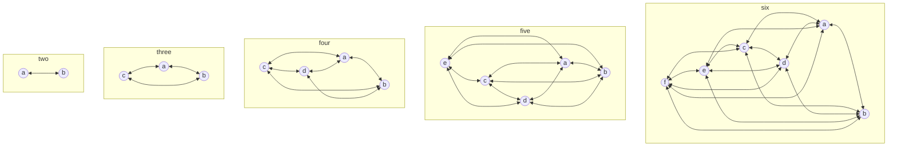

# Communication

> Communication happens in many forms. Use different channels for different
> purposes.

I define a communication channel as a combination of topics discussed and the
media used for those topics. For example, some teams use GitHub to discuss code
changes. I would call this channel "GitHub pull requests".

I advocate for communicating as much as possible in written form. It's best
for broadcasting and it's more inclusive than most communication forms. For
these reasons, this chapter mostly focuses on written communication.

In the past decade, it has become a fashion to use a chat system for all of
written communication. I call this "the chat nightmare".

Supposedly, it makes information flow in a transparent and durable way. Transparency and
durability are important qualities of good communication; there isn't anything
wrong with that. But making these qualities the sole goal of your communication
efforts shifts the focus from the who to the how.

At the risk of being repetitive: it's always about people. The key to a good
communication system is understanding that people need different amount of
information and modes of consumption to be happy. A good solution is to offer
different communication channels where information flows, and to make it clear that each
channel comes with its own style of consumption.

This approach clashes with the idea of using your chat system for everything.
Using the same media for all of your communication means everything has the same
importance and that everyone must experience it in the same way.

I'm arguing for using a variety of channels instead of just a chat system
for written communication. I'm going to provide a framework for evaluating and
organising written communication channels first and then discuss examples of my
favourite channels.

## The communication debugger

I use a checklist I call "the communication debugger" to clarify the main
characteristics of a channel. The goal is to clarify how and when to use it. We
want to reduce the risk of people not knowing if consuming a channel is
required for their role and how to best use it to share information. Here is the
checklist:

1. Do we need to store the information we share via this channel?
2. How relevant is contextual understanding?
3. What's a good media for this channel?

The order in which you ask these questions is relevant. If you want to live by
the principle _share everything by default_, you need to think of every channel
as optional _and_ accessible at the same time. A high level description of each
channel that answers these questions gives people a clear indication of how to
use them.

Nowadays, companies have so many ways of sharing information that people often
feel overwhelmed. As a response, some cope by muting as many channels as
possible. It's only human to react this way, but it comes with problems. People
don't know what they're missing any more and have no chance of adjusting over
time.

A practical example is error notification emails: the more your system grows,
the more non-actionable emails people receive, so they start creating rules to
reduce the noise in their inbox. One day something breaks and no one saw it
coming, right? You could say it's an engineering problem, but it's not. It's a
flaw of your communication infrastructure. Let me show you how I would use the
communication debugger checklist for error notifications:

1. Do we need to store the information we share via this channel?

   Do people know why these emails are relevant? Do you store the information
   anywhere? Can it be retrieved for later analysis?

2. How relevant is contextual understanding?

   Do people understand the exceptions? Are they receiving messages they don't
   understand because they've never worked on that part of the system?

3. What's a good media for this channel?

   Is an email with a stack trace the best media? Would graphs work better?
   Should we notify people of problems with different media depending on the
   severity of the problem?

Answering these question helps you design a good infrastructure for the channel
"system failures". Depending on the size of your teams, their structure, and
responsibilities you can choose the tooling, group exceptions, 
create new workflows, automate issue creation, and then solve them.

In the rest of the chapter, I use the communication debugger in many examples.
It's useful to determine features and usages of different channels. The
communication debugger may not help clarify the temporal aspect of channels.
Developers spend a great part of the day dealing with the written word. They
write code, discuss it in pull requests, write comments about features, describe
a bug in an issue tracker, and many other activities. They write so much that it's
hard to distinguish between written words that only matter _right now_ and
those that matter long term.

To cope with this, I group communication channels in volatile and
permanent. Volatile channels concern the present or the immediate future.
Permanent channels concern your long term communication.

## Volatile channels

Volatile channels are trickier to discuss than permanent ones, so I start with
them:

- They're the most used channels because that's where every-day communication
  happens. For this exact reason, they are often misused: communication that
  belongs to a permanent channel happens in the wrong place.
- Almost all of the volatile communication ends up in chat systems.

Misusing volatile channels is tragically common in our industry. Since most
teams use chat systems for their day-to-day communication, chats tend to get the
blame for the overall status of their communication infrastructure.

Instead of trying to come up with a sensible list of volatile channels that
works for everyone, let me use the communication debugger to define the scope
and goals of a volatile channel:

1. Do we need to store the information we share via a volatile channel?

   There is no need to store any of this information. Pull requests are again a
   good example: many tools store it and it's a "nice to have". But the point to
   stress here is that the data going through this channel is relevant only at
   the time of sharing. The perfect segue for the next question.

2. How relevant is contextual understanding?

   Everyday communication almost always requires contextual understanding. Are
   we shipping this feature _today_? What's your opinion on the candidate we
   interviewed _this morning_? Are we meeting _this afternoon_ to discuss how to
   improve the performance of that system? These examples have two things in
   common: the information is relevant right now _and_ contextual understanding
   is required. It's hard to discuss any of these topics if the information
   isn't fresh in people's minds.

3. What's a good media for this channel?

   The media isn't relevant here. The only two requirements are: people are fine
   using it and everyone has access to it.

In short, everyday communication channels have the following properties:

- Storing data isn't relevant.
- High contextual understanding is OK, often required.
- The media doesn't matter as long as it's inclusive.

With this in mind, I strongly encourage you to debug your existing channels.
Chances are your teams are already misusing one or more channels. Identifying
these false positives can have a great impact. Team productivity increases
if conversations happen in the right channel: less noise, more focused
communication.

### Status updates

Most product development teams follow an iterative approach to building
products, so status updates are a relatively common practice. You may want to
tell the rest of the company about the latest release or share how you solved a
difficult challenge. These are just a few examples of a communication practice
that has the following traits:

- It happens on a regular basis.
- Information is broadcasted.
- It's often a pain to maintain, mostly because of its cadence.

On the surface, it may not be obvious why this form of communication is an
instance of volatile communication, so here comes the communication debugger
checklist to the rescue:

1. Do we need to store the information we share via this channel?

   The meaning of a status update is strictly connected to the time in which the
   update happens: it describes progress or the lack of it. That means long-term
   storage isn't a requirement. Sometimes, it helps to relive the progress the
   organisation has been making over time, so I would consider storage a "nice
   to have".

2. How relevant is contextual understanding?

   It's fair to assume some contextual understanding of what's being shared.
   Updates would be unreasonably boring to read if they don't rely on prior
   knowledge. One thing I have seen working well is providing reference links:
   it's a way to enrich the new feature you are discussing with
   existing documentation and good examples. That way people with less context
   can dig into it if they need.

3. What's a good media for this channel?

   Broadcasting is the only strict requirement, so it's tempting to use a public
   channel of your chat system. That can work but, if I had to choose, I would
   go for a newsletter. First of all, newsletters feel more asynchronous than a
   chat. That releases people from the pressure of immediate consumption. Most
   people want to stay up-to-date with what's going on in the company, so
   reducing the pressure sends the message that you care about their needs. Another
   interesting aspect that comes handy while you scale teams is the aggregated
   analytics data you can gather. It helps you understand how to get better at
   sharing updates and communication in general. More about this in [The kaizen
   of communication](3-communication.md#the-kaizen-of-communication).

Status updates are a great way of exploring the mismatch between:

- What team members think they need to know.
- What team leaders think team members need to know.

Of course the truth lies somewhere in between and finding a balance is the
hardest part of getting communication right. Using the right kind of channel for
your status updates can have a positive effect on the culture of your teams and
their efficiency. Engaged team members help you debug the misunderstanding
and misalignment in your updates. That's a great side-effect. Keeping people
aligned is an important responsibility of leaders and doing it at scale without
support isn't feasible.

### Meeting notes

Meetings are non-inclusive by definition as they don't follow the _share
everything by default_ principle. Using meeting notes as a communication channel
can be of great benefit. It's enough to share them using one of the media you
use for everyday communication, so a chat system would be fine. I encourage,
sometimes even require, note taking and sharing because it helps both ways:

- It's a great example of a volatile channel.
- It helps to ensure that people understand what the point of meetings is: to
  reach a shared agreement. The habit of writing down outcomes and sharing them
  helps the attendees as well because they go into meetings focused on the
  outcomes. It also helps people that didn't attend the meeting. They don't feel
  excluded and can check the outcomes.

## Permanent channels

You often hear people say that the only constant in product development is
change. It's a catchy phrase and it paints a good picture of the everyday life
of product development. But it fails to tell the whole story: most of the
day-to-day work changes slowly.

We work on different things all the time, so change feels constant. But the way
we work doesn't change as fast. In fact, no matter how fast you ship changes to
your product, you don't change how you onboard new team members or operate your
servers as often.

The goal of permanent channels is to communicate what changes slowly in a team.
In most teams I've been part of, there was no form of communication covering
those aspects; they got lost in the sea of little things that change all the
time. What you choose to document or not says a lot about your culture,
it shows the focus of your engineering management style. Permanent channels
tell your teams what really matters to you.

Often information that belongs to a permanent channel gets
easily lost in a volatile one. A good example is architectural decisions. We
spend a great deal of time discussing code changes; improving our systems is an
important part of the job. Sometimes discussing a code change in a pull request
ends up being a conversation about the architecture of some system. You should
not have that conversation in a pull request: you want to store how
architectural decisions are taken because people without enough context
need to go back to that decision to understand their present. If you need to
store the outcome of a discussion, then a pull request isn't a good media: you
close pull requests once the code is merged and you can't easily tie them to
the big picture. You need a better-fitting channel. 

These mix-ups of volatile and permanent channels occur every day and there is no way you can control 
the outcome of all these conversations. Keep in mind that code reviews is just one
example, there is much more. Policing conversations doesn't scale and sends a
message of distrust to the teams, so crafting permanent channels and helping teams
use them is central to the role that leaders have in building communication
infrastructure.

Let's go over some examples.

### Developer book

Permanent channels give team members points of reference. You can think of the
information in these channels as tools to help people navigate the complex
aspects of their job. If someone is unsure about how to approach a problem, they
have some information as a starting point.

A developer book is the simplest and most effective permanent channel. A
developer book is a document that provides at least the following information:

- How to onboard new team members
- How we work
- How we operate
- How to offboard team members

I use this list as a table of contents for a first draft of this document. In
order to explain how to use a developer book, let me run the communication
debugger one more time:

1. Do we need to store the information we share via this channel?

   This document is a permanent channel, so the answer is obviously yes. You need
   to store the data for long-term consumption. People must be able to use the
   document as a reference guide, so it's vital that the document is available
   at any point in time.

2. How relevant is contextual understanding?

   **No** contextual understanding is a strict requirement. The point of the
   document is to remove implicit knowledge from within teams. You can think of
   the document as a map: if the information isn't clear, people get lost.

3. What's a good media for this channel?

   I suggest you store it where you store your code. Here is why: when I wrote such a
   document for the first time, I was afraid that people wouldn't read it, adopt it,
   or use it. I spent a great deal of time trying to find a way to ensure the
   success of the initiative. I came up with an approach that I find
   beautiful in its simplicity: I asked my teams to discuss changes to our
   processes via a pull-request to the repository of the developer book. The
   document became the point of reference for every discussion about the
   activities that don't involve coding. It happened fast because the workflow
   was familiar. When we agreed to change something, we merged the pull request
   and the doc was always up-to-date.

The table of contents I provided is just an example. I didn't try to be
specific by design. Different companies have different needs. Good examples of
topics you may want to cover in the document are:

- Diagrams (sequences, architecture)
- Incident management
- Reference readings

The only requirements are slow-pace change and, as always, people's needs for
information.

### Internal blog

As your teams scale, sharing knowledge becomes more and more important. You want to avoid
that different teams solve the same problem multiple times. A great way of
sharing knowledge is to write about what you learned in an internal blog.

Fostering a writing culture helps your teams in many ways:

- Becoming a better writer helps becoming a better developer, too.
- People can proudly share their achievements and simultaneously help other team
  members learn something new.

Let me examine the characteristics of the channel using the communication
debugger:

1. Do we need to store the information we share via this channel?

   It's necessary to store this data for long-term consumption. Blog posts are
   often long reads, so people need a way to read them when they have time.
   Archives are a nice feature too when you are thinking about past experiences.

2. How relevant is contextual understanding?

   A bit of contextual understanding should be the norm for blog posts. It's OK
   to make some assumptions about the audience. It's not OK to assume the reader
   knows everything about the content because that defeats the purpose of
   sharing knowledge.

3. What's a good media for this channel?

   Whatever blog system your teams are comfortable with.

You may be wondering what the right topics for blog posts are.
A good answer is whatever people feel like sharing. Avoid policing content:
people must be free to share what they think is important to share. It only
works if people use an internal blog as an actual blog.

A nice side-effect: internal blogging makes public blogging much easier. The
delta between "something we wrote for ourselves" and "something we want to share
with the world" is often small. A public blog is a great marketing activity, it
helps with hiring and improves the mood of your teams. It can feel great to
share what you're doing with the rest of the world.

## Backlog and roadmap

In [Process](4-process.md), I discuss workflows and how they impact the everyday
life and productivity of teams. Here I focus on the tooling we use to operate
our workflows: backlogs and roadmaps. Although these tools depend on the
workflow of choice, it's easy to forget that, at their core, they're
communication tools. As we may forget that, we often try to change our
workflows instead of focusing on the efficiency of our communication.

First of all, let me say how I define these terms:

- Backlog

  I think of a backlog as a written list of short-term tactical goals. It structures,
  organises, and visualises the tactical aspects of your strategy. Its main
  function is to answer the question "What are we going to do soon?". "How soon"
  depends on your workflow and it's out of the scope of this conversation.

- Roadmap

  Roadmap's main function is to answer the question "Where are we going as a team?"
  It communicates a vision and a purpose. It gives teams the opportunity to take
  everyday decisions without forgetting the big picture.

These tools are shared and discussed within the product management group. Every company interprets the
product manager role in a different way, and that has implications on how the
day-to-day relationship between a product manager and their development team works. 
The shared nature of these tools is exactly what makes them so
relevant from a communication standpoint. The better these tools work, the more
productive the entire organisation is going to be.

As backlogs and roadmaps answer different questions, I discuss them separately.
Let's start with roadmaps.

A roadmap is a physical or digital representation of a team's mission. Each team
has a mission and the roadmap represents its execution. What's relevant to the
communication infrastructure of your organisation is the feedback loops a
roadmap enables. Two loops are particularly important:

- If developers have a good understanding of the big picture, they can take more
  thoughtful decisions about the system they're building. Every technical
  decision is a trade-off between what works now and what needs to work
  tomorrow. The more developers know about what's coming, the clearer the
  distinction between now and the future becomes. You know this is working when
  you can hear developers say something like "We're going to do it this way
  because X is coming up. There is no point in doing Y either".

- Often developers don't really know what happens to the features they ship. A
  good roadmap must provide a mechanism to close the gap between shipping a
  feature and rolling it out to customers. For example, you could batch all the
  recently shipped features in a section of the roadmap called "To verify".
  These features stay there until you verify that they worked out. This
  benefits both developers and product managers. Developers know why they built
  a feature and how customers use it. Product managers are held accountable
  for their decisions and can celebrate their success.

Backlogs are trickier because they're on the edge of two different functions. A
feature in the backlog represents an output for product managers and an input for developers.
This duality has some implications.

Product managers consider backlogs a means to an end: they put stories in a
backlog because that's how one builds a product. I
sometimes joke that a backlog is just an organised wish-list.

On the other hand, developers consider their backlog as a series of requests for
change to the system they're responsible for. So they spend time looking for
things like inconsistency and feasibility. This often leads to unproductive
communication. It can make people feel they aren't working towards the same
goal.

Designing a good backlog is hard because of its duality: it represents an output for some team members
and an input for others. I ask developers and product managers to
find the simplest approach that works for both parties. The way I guide them in
this process is by helping them focus on the backlog as a communication tool: it's how
product managers say "This is what we're working on short term". It's not a place
for transactional work; it's a place for a high-level collaboration between two parties
that have one goal: shipping awesome work.

Teams are always different from each other, so good backlogs should reflect that.
Depending on the team, some aspects are going to be more important than others.
Trying to standardise how backlogs look across teams is doomed to fail. I've
made this mistake myself more than once.

It's best to focus on what makes a backlog an effective communication channel.
First of all, features in a backlog have to be work-ready. It may seem
obvious because the goal of the backlog is to organise the short-term tactical goals
of a team. But I've seen the backlog being used as a forum for discussion far
too many times.

A backlog needs to be as small as it can be, but not smaller. Once again, the
idea is to communicate what's coming shortly. There is no point in
populating the backlog with things that you aren't going to build in the immediate future.

Different teams may put different kinds of tasks in their backlogs. I've seen
teams that use backlogs only for features and bugs, while other teams also create tickets for 
data migration, reports, system maintenance. The key is that team members
agree on what goes in their backlog and have an good way to visualise task
types. The backlog shouldn't lead to more questions, it
needs to clearly answer the question "What's coming up next?".

## The links formula

I've only discussed written communication so far, and it's time to shift my
attention towards interpersonal communication between team members. This is by
far the trickiest form of communication for you as a leader. By
definition, it mostly happens without you being involved.

How can you help a group of people have productive conversations with each
other?

The problem is hard, so I have a mental model for it. It's built upon a
concept I call the "links formula". A link is a line of communication between
two distinct team members. Here is one way to formalise this concept:

```haskell
links n = div (n * (n -1)) 2
links(2) => 1
links(3) => 3
links(4) => 6
links(5) => 10
links(6) => 15
```

The visual representation of this formula is even more striking:



As you can see, the number of connections grows fast, really fast. This growth
trajectory makes any attempt of working on interpersonal communication at "link
level" impossible. In other words, it doesn't make sense to work on this
channel from the perspective of _all_ your team members _at once_. It's too
complicated; there are too many links.

This is where my mental model comes into play. The idea is to leverage the
concept of a link and maintain a visual representation of these links. To build
this model, I use the following strategy:

- I ask people in the team how they feel about their interpersonal communication
  with other people. This is a private conversation, so I find one-on-ones to be
  the best space to check in on this.
- I use colours to visualise the links. My approach: a "red link" means
  something is wrong, a "yellow link" means that I need to pay attention, and a "blue link" means
  that everything is fine.
- I draw a graph for each team member with the relevant links.

Such a graph gives me a sense of the team's communication well-being. Sometimes people
are stressed out in their life and that reflects on their interpersonal
communication. As a leader, you are less likely to experience the impact of
such a situation compared to the rest of the team. In such cases, you can see
that the links connecting to that person change colour. You can spot patterns and that can
help focus your attention.

The links formula also tells us that you can't use it for a large team. The
picture becomes too colourful and the problem is again too complicated to solve. In
[When to split teams](5-teams.md#when-to-split-teams), I discuss the
implications of this limitation and how to handle them.

## The kaizen of communication

[Kaizen](https://en.wikipedia.org/wiki/Kaizen) is the Japanese word for
"continuous improvement". It's common to come across this term when reading about
Kanban.

The "kaizen of communication" is what I call the process of systematically
asking for feedback. Communication is never in its ideal state because no channel works
perfectly. There are always channels you could be using better, there
are always team members that feel left out of a specific conversation.

Scaling communication is hard: it's common to keep using the same channels and
structure for a long time and then realise that they aren't working. Over the years, I tried
different techniques in the quest of improving communication. I'm now convinced that using surveys to improve
communication at scale is what works best. After all, if you don't know
something, asking involved parties for help can only be beneficial. A survey about the state of
communication in your teams is a delicate subject, so here are a few suggestions
based on my experience:

- The survey must be completely anonymous. Make sure you use a tool that
  supports anonymous surveys and communicate it clearly to your teams. You are
  not going to gather negative feedback otherwise. And what isn't working is
  exactly what you are after.

- Have as many closed questions as possible. Best is to ask questions that can
  be easily aggregated and visualised. I suggest using a [Likert
  scale](https://en.wikipedia.org/wiki/Likert_scale) which helps create
  less biased questions.

- Test your questions. Coming up with clear, non-ambiguous questions is hard. Do
  not guess, benchmark.

- The results you share must be aggregated so that personal information can't be
  extracted. This is important as it's easy to fall for a blaming game. If
  people can infer from a survey things like "No one likes to work with this
  product manager", you are creating trouble not insight.

A good survey gives your team actionable feedback. Concluding from a survey that "We
aren't happy with X" doesn't help. It's good to know, but it doesn't give
you anything you can work with.

The way you design your questions has a big impact on how actionable the
feedback is. For example, consider the following question:

> How happy are you with X from 1 to 10?

Answers to this question don't help. The example is trivial, but I can't say I
didn't make such a mistake. The easiest solution is to break down the question
into more specific questions:

> Do you find X to be the right tool for Y?
> What do you use X for? (Pick up to N options)

These questions help you understand whether your teams agree on the way X is used
and what they actually use it for.

Sharing the results of surveys and discussing them is important. There are
at least two reasons to do so:

- It helps clarify those little bits that no survey or piece of writing ever
  could.
- It makes the entire conversation about communication as clear as possible.

Communication is hard and never done so, at times, it's going to be a little
discouraging and tiring to improve it. To make things even harder,
communication doesn't improve in a day's time, so you won't see immediate results.

When I get discouraged, I stop working on the day-by-day operations of the team
for half a day and do a root analysis of our most recent bug reports. I know I can
often link a bug to a simple miscommunication between people. That gives me an
action plan I can use to bring the motivation back.
